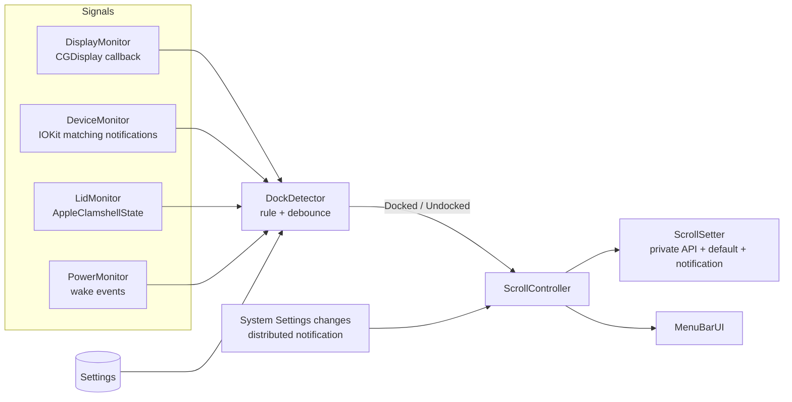
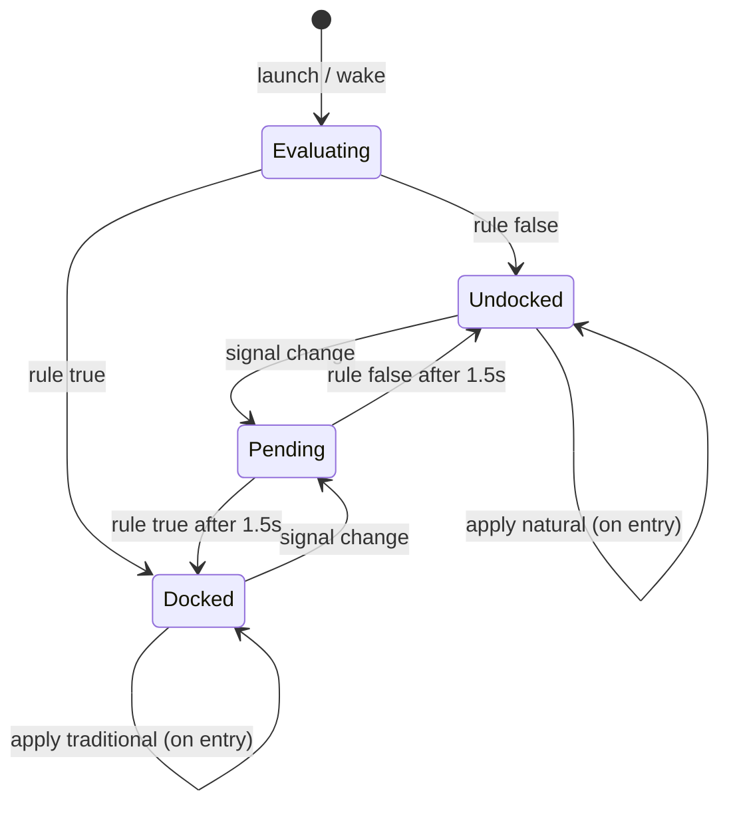

# ScrollSwitch: Automatic Natural Scrolling Toggle for macOS

**Spec version:** 2.0 (draft)
**Date:** October 9, 2026
**Owner:** Jinay Doshi
**Platform:** macOS 13 Ventura or later, Apple silicon and Intel
**Stack:** Swift 5.9+, SwiftUI (menu bar app), AppKit, IOKit, Core Graphics

---

## 1. Problem

macOS has **one** "Natural scrolling" setting shared by the trackpad and the mouse.

My setup has two states:

| State | How I use the Mac | Natural scrolling |
|-------|-------------------|-------------------|
| **Undocked** | Lid open, built-in trackpad | **ON** |
| **Docked** | Lid closed (clamshell), KVM with 2 external monitors, keyboard, mouse | **OFF** |

I never use the trackpad while docked, so a single global setting is fine. The only problem is that I flip it by hand in System Settings every time I dock or undock.

**ScrollSwitch automates exactly that manual step.** When the Mac becomes docked, it turns Natural scrolling off. When it becomes undocked, it turns it back on.

## 2. Goals and non-goals

### Goals

1. Flip the real system Natural scrolling setting automatically on dock/undock.
2. Apply the change live, with no logout and no System Settings window opening.
3. Switch within 3 seconds of plugging in or unplugging the KVM.
4. Run quietly in the menu bar, start at login, use almost no CPU or battery.
5. Handle KVM switching, sleep/wake, and reboots without getting stuck in the wrong state.
6. Let me manually override or pause from the menu bar.

### Non-goals (v1)

- Different scroll directions for the trackpad and mouse at the same time (not needed for my workflow, see Appendix A).
- Scroll speed, smoothing, or button remapping.
- Mac App Store distribution (the app can't be sandboxed, see Section 9).

## 3. Background: how the setting works

- The value is stored in the global user default `com.apple.swipescrolldirection` (`true` = natural).
- Writing it with `defaults write -g ...` **only updates the stored value.** The actual scroll behavior does not change until logout. That is why simple scripts don't work.
- System Settings applies it live by calling a function named `setSwipeScrollDirection(bool)` in the private framework `PreferencePanesSupport.framework`. This was found by reverse engineering the Mouse preference pane (Shadowfacts, "A Mac Menu Bar App to Toggle Natural Scrolling", 2021).
- After a change, macOS uses the distributed notification `SwipeScrollDirectionDidChangeNotification` so System Settings can update its checkbox.

**Risk:** this is a private Apple API. It worked as of the 2021 write-up, but it needs to be confirmed on my current macOS version before anything else gets built. That is Milestone 0.

## 4. User stories

| ID | Story |
|----|-------|
| US-1 | When I plug into the KVM and close the lid, scrolling switches to traditional without me doing anything. |
| US-2 | When I unplug and open the lid, scrolling switches back to natural. |
| US-3 | I can see in the menu bar whether I'm "Docked" or "Undocked" and what the setting currently is. |
| US-4 | I can teach the app what "my dock" is with one click while plugged in. |
| US-5 | I can pause automation or force a direction from the menu bar. |
| US-6 | The app starts by itself after a reboot. |
| US-7 | If I flip the setting manually in System Settings, the app doesn't immediately fight me. |

## 5. Functional requirements

| ID | Requirement | Priority |
|----|-------------|----------|
| FR-1 | Read the current Natural scrolling value. | Must |
| FR-2 | Set Natural scrolling on/off live, without logout. | Must |
| FR-3 | Detect external displays being connected and disconnected. | Must |
| FR-4 | Detect external pointing devices (mouse) being connected and disconnected, including through the KVM's USB hub. | Must |
| FR-5 | Decide Docked vs Undocked using a configurable rule (Section 6.3) and debounce noisy changes. | Must |
| FR-6 | On a Docked/Undocked change, apply the configured direction for that state. | Must |
| FR-7 | Re-check state on wake from sleep and on app launch. | Must |
| FR-8 | Menu bar icon and menu showing state, current direction, pause, force natural/traditional, Preferences, Quit. | Must |
| FR-9 | Launch at login. | Must |
| FR-10 | "Learn my dock" button that records the currently connected external displays and mice as dock markers. | Should |
| FR-11 | Respect manual changes: if the setting changes outside the app, don't override it until the next Docked/Undocked transition. | Should |
| FR-12 | Optional lid (clamshell) state as an extra docking signal. | Could |
| FR-13 | Log viewer with the last 200 events (device/display changes, state changes, direction changes). | Should |
| FR-14 | Optional macOS notification when the direction changes. | Could |

## 6. Architecture

### 6.1 Component overview



### 6.2 Components

**DisplayMonitor**
- `CGDisplayRegisterReconfigurationCallback` for add/remove events.
- For each external display (`CGDisplayIsBuiltin == false`), records vendor (`CGDisplayVendorNumber`), model (`CGDisplayModelNumber`), and serial (`CGDisplaySerialNumber`).
- Note: in clamshell mode the built-in display disappears from the list. That is expected.

**DeviceMonitor**
- Uses `IOServiceAddMatchingNotification` on the `IOHIDDevice` class, filtered to Generic Desktop page, usage Mouse or Pointer.
- This only watches devices appear and disappear. It never opens them, so it should **not** need Input Monitoring permission. (Using `IOHIDManagerOpen` instead would likely trigger that permission prompt.)
- Reads vendor ID, product ID, product name, transport, and `Built-In`. Ignores the built-in trackpad.

**LidMonitor** (optional signal)
- Reads the `AppleClamshellState` boolean from the `IOPMrootDomain` registry entry.
- Re-read whenever a display or power event fires.

**PowerMonitor**
- Listens for `NSWorkspace.didWakeNotification`. On wake, triggers a full re-scan.

**DockDetector**
- Combines signals with the rule from Section 6.3.
- Debounces for 1.5 seconds. KVMs often add and remove devices several times in a burst while switching, and monitors can take a moment to come up.
- Emits only real transitions: `undocked → docked` or `docked → undocked`.

**ScrollController**
- On a transition, applies the direction configured for that state (defaults: docked = traditional, undocked = natural).
- Skips the call if the setting already has the right value.
- Tracks manual overrides (FR-11).
- Handles pause and force modes from the menu.

**ScrollSetter**
- The only component that touches the system setting. Details in Section 7.

**MenuBarUI**
- SwiftUI `MenuBarExtra` plus a small Preferences window. `LSUIElement = YES` so there is no Dock icon.

### 6.3 Docking rule

Configurable in Preferences, in plain terms:

| Rule | Docked when... | Good for |
|------|----------------|----------|
| **Dock markers (default after "Learn my dock")** | Any recorded KVM display **or** recorded KVM mouse is present | Most reliable. Ignores random monitors or a Bluetooth mouse in a classroom. |
| Any external display | At least one external display is connected | Simple. Works out of the box before learning. |
| Any external mouse | At least one external mouse is connected | Setups with no monitor. |
| + Lid closed (modifier) | The chosen rule is true **and** the lid is closed | Extra safety, since I always close the lid when docked. |

Default before "Learn my dock" is used: **Any external display.** That matches my setup on first launch with zero configuration.

### 6.4 State machine



If Pending settles back into the same state it came from, nothing is applied.

### 6.5 Manual override behavior (FR-11)

1. ScrollController subscribes to `SwipeScrollDirectionDidChangeNotification` on `DistributedNotificationCenter`.
2. When it fires and the change was **not** made by ScrollSwitch, mark `manualOverride = true`.
3. While `manualOverride` is true, do nothing until the next real Docked/Undocked transition. Then clear the flag and apply normally.
4. Menu shows "Manual override (until next dock change)."

## 7. Setting the direction (ScrollSetter)

### 7.1 Primary method

Three steps, in order:

1. Call the private `setSwipeScrollDirection(Bool)` from `PreferencePanesSupport.framework`. This is the step that changes actual scroll behavior live.
2. Write `com.apple.swipescrolldirection` to the global domain and synchronize, so the stored value definitely matches.
3. Post `SwipeScrollDirectionDidChangeNotification` so System Settings updates its checkbox if it's open.

Load the private function at runtime with `dlopen`/`dlsym` rather than linking the framework. If Apple removes or renames it, the app shows a clear error instead of crashing on launch.

```swift
import Foundation

enum ScrollDirection { case natural, traditional }

final class ScrollSetter {
    private typealias SetSwipeFn = @convention(c) (Bool) -> Void
    private let setSwipe: SetSwipeFn?
    private(set) var lastWriteByUs = Date.distantPast

    static let key = "com.apple.swipescrolldirection" as CFString
    static let changedNote = Notification.Name("SwipeScrollDirectionDidChangeNotification")

    init() {
        let path = "/System/Library/PrivateFrameworks/PreferencePanesSupport.framework/PreferencePanesSupport"
        if let handle = dlopen(path, RTLD_LAZY),
           let sym = dlsym(handle, "setSwipeScrollDirection") {
            setSwipe = unsafeBitCast(sym, to: SetSwipeFn.self)
        } else {
            setSwipe = nil   // surface "unsupported macOS" in the UI
        }
    }

    var isSupported: Bool { setSwipe != nil }

    var current: ScrollDirection {
        let v = CFPreferencesCopyAppValue(Self.key, kCFPreferencesAnyApplication) as? Bool
        return (v ?? true) ? .natural : .traditional   // macOS default is natural
    }

    func apply(_ dir: ScrollDirection) {
        let natural = (dir == .natural)
        lastWriteByUs = Date()

        // 1. Live change
        setSwipe?(natural)

        // 2. Stored value
        CFPreferencesSetAppValue(Self.key, natural as CFBoolean, kCFPreferencesAnyApplication)
        CFPreferencesAppSynchronize(kCFPreferencesAnyApplication)

        // 3. Tell System Settings
        DistributedNotificationCenter.default().postNotificationName(
            Self.changedNote, object: nil, userInfo: nil, deliverImmediately: true)
    }
}
```

`lastWriteByUs` lets ScrollController ignore its own notification (anything within ~1 second of our write) when detecting manual overrides.

**Do not** call `UserDefaults.standard.setPersistentDomain(_:forName: UserDefaults.globalDomain)`. The Shadowfacts write-up reports this wiped a bunch of unrelated global settings.

### 7.2 Fallback if the private API is gone

If Milestone 0 shows the function no longer works on my macOS version:

1. **Check for a renamed symbol.** Run `nm` / `dyld_info` on the shared cache copy of `PreferencePanesSupport` and other private frameworks for anything containing `SwipeScroll`.
2. **UI scripting.** Use AppleScript (via `NSAppleScript`) to open System Settings to the Mouse/Trackpad pane and click the toggle. Slow (~1–2 seconds), flashes a window, and needs Accessibility permission, but it uses the same path I use by hand. Close the window afterward.
3. **Per-device inversion** (Appendix A). Different approach, but avoids private APIs entirely.

## 8. Settings model

Stored in the app's own `UserDefaults`. Nothing leaves the machine.

```swift
enum DockRule: String, Codable { case markers, anyExternalDisplay, anyExternalMouse }

struct DisplayID: Hashable, Codable { let vendor: UInt32; let model: UInt32; let serial: UInt32 }
struct MouseID: Hashable, Codable { let vendorID: Int; let productID: Int }

struct Settings: Codable {
    var automationEnabled = true
    var rule: DockRule = .anyExternalDisplay
    var requireLidClosed = false
    var dockedDirection: ScrollDirection = .traditional
    var undockedDirection: ScrollDirection = .natural
    var markerDisplays: [DisplayID] = []
    var markerMice: [MouseID] = []
    var debounceSeconds = 1.5
    var notifyOnChange = false
    var launchAtLogin = true
}
```

"Learn my dock" fills `markerDisplays` and `markerMice` from whatever external devices are connected right now, then switches `rule` to `.markers`.

## 9. User interface

### 9.1 Menu bar icon

| State | SF Symbol | Meaning |
|-------|-----------|---------|
| Docked, traditional | `computermouse` | Mouse mode |
| Undocked, natural | `hand.point.up.left` | Trackpad mode |
| Paused / manual override | `pause.circle` | Automation not acting |
| Error (API unavailable) | `exclamationmark.triangle` | Click for details |

### 9.2 Menu

```
ScrollSwitch: Docked
Scrolling: Traditional
──────────────────────────
Detected
   DELL U2723QE (dock marker)
   DELL U2723QE (dock marker)
   USB Optical Mouse (dock marker)
   Lid: Closed
──────────────────────────
Force Natural
Force Traditional
Pause Automation
──────────────────────────
Learn My Dock (use what's connected now)
Preferences…
Show Log…
Quit ScrollSwitch
```

### 9.3 Preferences (one window, three sections)

- **General:** Automation on/off, Launch at login, Notify on change, Docked direction, Undocked direction.
- **Docking:** Rule picker, Require lid closed, list of dock markers with remove buttons, "Learn My Dock" button, debounce slider.
- **Status:** whether the scroll API is supported on this macOS version, current raw values, Show Log.

## 10. Permissions, signing, distribution

| Item | Needed? | Notes |
|------|---------|-------|
| App Sandbox | **Must be OFF** | Writing to the global preferences domain fails inside the sandbox. In Xcode, set **Build Settings → Enable App Sandbox = No** (removing the capability alone may not be enough). |
| Accessibility | No (only for the UI-scripting fallback) | |
| Input Monitoring | No | Because DeviceMonitor only watches for devices and never opens them. |
| Launch at login | `SMAppService.mainApp.register()` | macOS 13+. |
| Signing (personal use) | Free Apple Development certificate | Build and run from Xcode. |
| Signing (sharing) | Paid Developer ID + notarization | Only if I give it to other people. |

## 11. Edge cases

| Case | Expected behavior |
|------|-------------------|
| KVM switched to the other computer | Mac may lose the displays and mouse, so it goes Undocked → natural. Harmless since I'm not using it. Switching back makes it Docked again. Debounce prevents flip-flopping during the switch. |
| KVM keeps a fake mouse attached when switched away | Display rule still works. If using markers, displays decide. |
| Burst of add/remove events while plugging in | Debounce collapses it into one transition. |
| Mac sleeps docked, wakes undocked (or reverse) | PowerMonitor re-scans on wake and applies the right direction. |
| Monitors take a few seconds to wake after the Mac wakes | Debounce plus re-evaluation on every display callback catches it. |
| Plugging in a projector or random monitor in class | With "Any external display," flips to traditional. "Learn my dock" (markers) avoids this. |
| I change the setting by hand | Manual override respected until the next dock change. |
| macOS update removes the private API | App detects at launch, shows error icon, does nothing harmful. Fallbacks in Section 7.2. |
| App quits or crashes | Setting stays wherever it was. On next launch, it re-evaluates and corrects. |
| Setting already correct | Skip the apply call. |

## 12. Performance targets

- Idle CPU: effectively 0% (event-driven, no polling).
- Memory: under 30 MB.
- Plug-in to direction switched: under 3 seconds (1.5 s debounce + display wake time).
- Zero wrong-direction states after one week of daily dock/undock.

## 13. Testing plan

### 13.1 Unit tests
- `DockDetector`: feed sequences of display/mouse/lid events for each rule and check the transitions. Include a burst test (5 add/remove events within 1 second → exactly one transition).
- `ScrollController`: correct direction per state, skip when already correct, manual override set and cleared correctly, pause and force modes.
- Use a fake `ScrollSetter` protocol in tests so tests never change my real setting.

### 13.2 Manual test matrix

| # | Start | Action | Expected |
|---|-------|--------|----------|
| 1 | Undocked, natural | Plug in KVM, close lid | Traditional within 3 s |
| 2 | Docked, traditional | Unplug KVM, open lid | Natural within 3 s |
| 3 | Docked | Switch KVM to other computer and back | Ends Docked, traditional |
| 4 | Docked | Sleep 10 min, wake | Still traditional |
| 5 | Docked | Sleep, unplug, wake undocked | Natural |
| 6 | Any | Reboot | App auto-starts, correct direction |
| 7 | Docked | Toggle setting in System Settings | App leaves it alone, shows override |
| 8 | Test 7 state | Undock | Override cleared, natural applied |
| 9 | Any | Pause, then dock/undock | No changes made |
| 10 | Docked | Open System Settings → Mouse | Checkbox matches actual behavior |
| 11 | Any | Scroll in Safari, Chrome, Finder, VS Code after each switch | Direction correct everywhere without relaunching apps |

## 14. Project structure

```
ScrollSwitch/
├── ScrollSwitch.xcodeproj
├── ScrollSwitch/
│   ├── App/
│   │   └── ScrollSwitchApp.swift      // @main, MenuBarExtra
│   ├── Core/
│   │   ├── DockDetector.swift
│   │   ├── ScrollController.swift
│   │   ├── ScrollSetter.swift
│   │   └── Settings.swift
│   ├── Monitors/
│   │   ├── DisplayMonitor.swift
│   │   ├── DeviceMonitor.swift
│   │   ├── LidMonitor.swift
│   │   └── PowerMonitor.swift
│   ├── UI/
│   │   ├── MenuView.swift
│   │   ├── PreferencesView.swift
│   │   └── LogView.swift
│   ├── Support/
│   │   └── Logger.swift               // os.Logger + ring buffer
│   └── Info.plist                     // LSUIElement = YES
├── ScrollSwitchTests/
└── README.md
```

No third-party dependencies.

## 15. Milestones

| Milestone | Scope | Done when |
|-----------|-------|-----------|
| **M0: API spike** | Tiny command-line Swift tool that calls `ScrollSetter.apply(.traditional)` then `.natural`. | Scrolling actually flips live on my Mac's current macOS version. **If this fails, go to Section 7.2 before building anything else.** |
| **M1: Manual toggle app** | Menu bar app with Force Natural / Force Traditional and current-state display. Sandbox off. | I can replace my manual System Settings routine with one click. |
| **M2: Auto-detection** | DisplayMonitor, DeviceMonitor, PowerMonitor, DockDetector with debounce, "Any external display" rule. | Manual tests 1–6 pass. |
| **M3: Polish** | Learn My Dock, markers, lid option, manual override, pause, launch at login, Preferences, log. | Tests 7–11 pass. All Must and Should FRs done. |
| **M4: Daily-use hardening** | Unit tests, one week of real use, fix anything that went wrong. | Section 12 targets met. |

M1 is already useful on its own, so even a partial build pays off.

## 16. Open questions

1. Does `setSwipeScrollDirection` still work on my current macOS version? (M0)
2. Does my KVM drop the displays and mouse when switched to the other computer, or keep fake devices attached? (Watch the log in M2.)
3. How long do my monitors take to show up after plugging in? Tune the debounce if 1.5 s is too short.

## 17. Acceptance criteria (v1 is done when)

- [ ] Docking switches Natural scrolling off, undocking switches it on, with no manual steps and no logout.
- [ ] System Settings always shows the same value as the actual behavior.
- [ ] KVM switching, sleep/wake, and reboot all end in the correct direction.
- [ ] Manual changes are respected until the next dock change.
- [ ] App launches at login, lives only in the menu bar, and needs no extra permissions.
- [ ] All tests in Section 13 pass.

---

## Appendix A: Alternative considered (per-device inversion)

Instead of flipping the global setting, an app can leave Natural scrolling on and use a `CGEventTap` to invert only scroll events from a mouse wheel (wheel events are "discrete," trackpad events are "continuous" with gesture phases). This is how tools like Scroll Reverser and UnnaturalScrollWheels work.

**Why not the main design:** I never use the trackpad while docked, so per-device control adds complexity (Accessibility permission, event classification, edge cases with smooth-scroll mice) for no real benefit. It stays here as a fallback if Apple ever removes the private API in Section 7.

## Appendix B: References

- Shadowfacts, "A Mac Menu Bar App to Toggle Natural Scrolling" (2021): reverse engineering of the Mouse preference pane, `setSwipeScrollDirection` in `PreferencePanesSupport.framework`, the distributed notification, and the sandbox gotcha. https://shadowfacts.net/2021/scrollswitcher/
